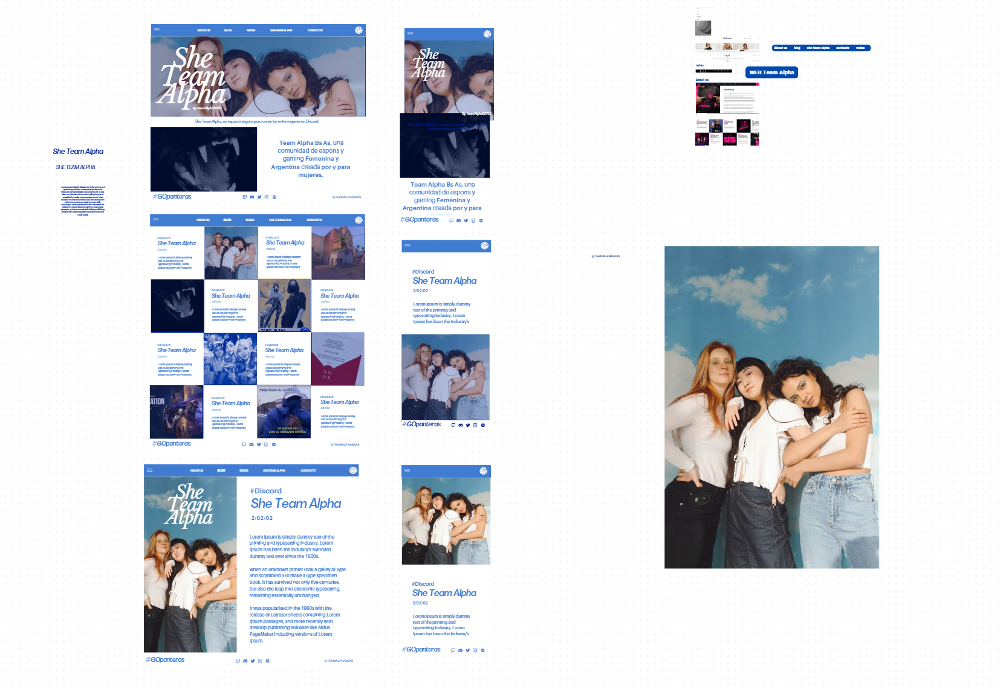

 
 

# Trabajo Práctico Parte 1 — HTML CSS

## Objetivo

El objetivo de este trabajo práctico es que los estudiantes demuestren sus habilidades con las herramientas que utilizarán en el desarrollo web. Está diseñado para evaluar sus capacidades en la creación de sitios web estáticos mediante HTML y CSS.

Pondremos el foco en obtener un **código simple, bien diseñado y organizado**, así como el cumplimiento de todos los requerimientos solicitados.

**Fecha de entrega:** 14 de octubre.
 
 

## Requisitos de Stack

Para el desarrollo de la aplicación deberá utilizar:

- HTML
- CSS
- _(opcional)_ Bootstrap

Importante saber:

- Se puede utilizar Bootstrap para los estilos, pero se requiere un mínimo de estilos en CSS puro.
- No es obligatorio pero se valora el diseño responsive.
- Se evaluará el uso de etiquetas semánticas HTML.
   
   

## Desarrollo del trabajo práctico

- Se deberá clonar o "forkear" este repositorio para poder modificarlo y completarlo con la resolución del proyecto.
- Una vez que su código esté listo, suba el código a un repositorio público propio y envíenos el enlace a dicho repositorio para que lo revisemos.

  

## Trabajo Práctico

Usando la estructura estandar de un documento html, deberá crear un conjunto de tres pantallas para crear la web solicitada.

Además, agregue la siguiente información a su archivo `README`:

- ¿Hay alguna mejora que pueda hacer en su envío?
-  `En principio finalizaria la pestaña cotacto, agregando formulario, en cuanto a diseño no creo uqe mojoraria nada por el momento, cuando tenga que agregar mas cosas al projecto iria viendo la integracion`
- ¿Qué haría de manera diferente si se le asignara más tiempo?
-   `Creo que el tiempo dado fue coherente para el tipo de trabajo pedido, no cambiaria nada en este caso, estoy contento con el resultado.`
   
   

## Detalles

Necesitará construir las siguientes pagínas:
 
 

- Una pagína Home, será la página principal del sitio. _(index.html)_
   

  > Deberá incluir lo siguiente:
  >
  > - Header: Incluir navbar con enlaces a las páginas de "Home", "SignIn" y "SignUp".
  > - Sección 1: Un título principal que dé la bienvenida al usuario, acompañado de un párrafo introductorio.
  > - Sección 2: Una sección destacada que describa el propósito del sitio o los servicios ofrecidos o cualquier otro tipo de información complementaria.
  > - Footer

 
 

- Una pagína SignIn. _(signIn.html)_
   

  > Deberá incluir lo siguiente:
  >
  > - Header: Incluir navbar con enlaces a las páginas de "Home", "SignIn" y "SignUp".
  > - Formulario de inicio de sesión: Debe permitir el ingreso de un correo electrónico y una contraseña.
  > - Footer

 
 

- Una pagína SignUp. _(signUp.html)_
   

  > Deberá incluir lo siguiente:
  >
  > - Header: Incluir navbar con enlaces a las páginas de "Home", "SignIn" y "SignUp"
  > - Formulario de registro: Debe permitir ingresar nombre, apellido, correo electrónico, contraseña y repetir contraseña.
  > - Footer

 
 

**Importante**

- Siéntase libre de agregar todo lo que desee. En etapas más avanzadas, agregaremos JavaScript para darle funcionalidad y, finalmente, conectaremos con nuestro propio servidor backend.

- Como partes de un equipo, creemos que la comunicación es la clave del éxito. Entonces, si algo no está claro, o si tiene dudas sobre la tarea, consultanos!
   
   

> Happy coding!

## Trabajo Práctico

En base a su experiencia en el desarrollo de la parte práctica del TP1

- ¿Hay alguna mejora que pueda hacer en su envío? (TP1) 
  `En principio finalizaria la pestaña cotacto, agregando formulario, en cuanto a diseño no creo uqe mojoraria nada por el momento, cuando tenga que agregar mas cosas al projecto iria viendo la integracion`  
- ¿Qué haría de manera diferente si se le asignara más tiempo? 
  `Creo que el tiempo dado fue coherente para el tipo de trabajo pedido, no cambiaria nada en este caso, estoy contento con el resultado.`  
- En su trabajo, ¿cuál considera que fue lo más difícil de realizar? 
  `En mi caso particular lo mas complicado fue el tema de las imagenes, ya que trabaje con una misma imagen sin tenerla en distintos tamaños, y el adaptarlo al responsive fue el reto, para poder seguir el diseño que tenia en mente y no modificarlo mucho`  
- En las entregas, detectamos una gran variedad de temáticas únicas e interesantes. ¿Podría decirnos en qué se inspiró para realizar su página web? ¿Utilizó alguna página existente como referencia? 
  `En mi caso la Pagina la realice en base a un diseño que hizo mi novia, ella tiene una comunidad femenina de esports que se llama Team Alpha y ella habia realizado el diseño en un momento, adapte algunas cuestiones para cumplir con lo pedido en la consigna, pero estaba el diseño ya dado, y para ese diseño se habia tomado como referencia la pagina del equipo del kun aguero KRU, abajo dejo las referencias del diseño como se penso originalmente.`  
 
